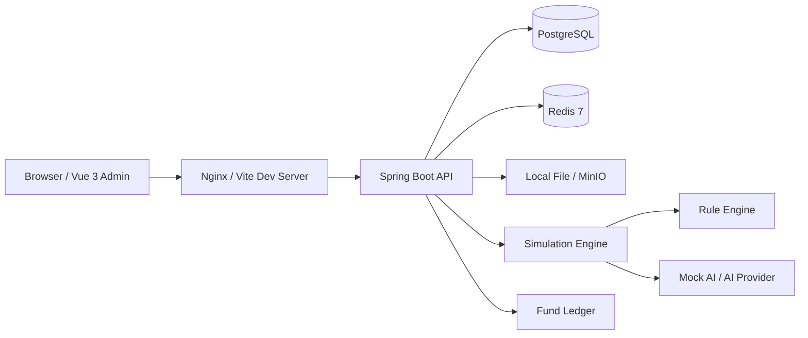
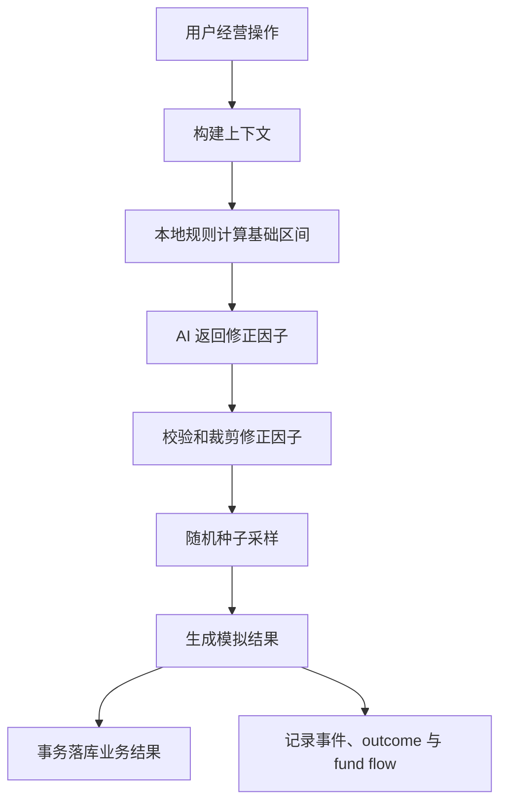
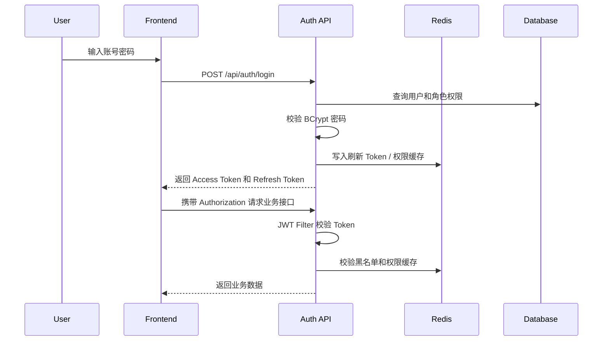
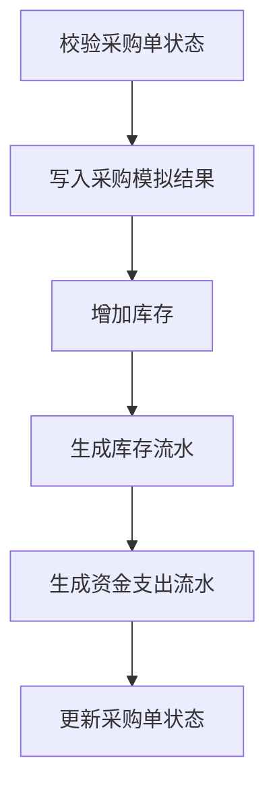
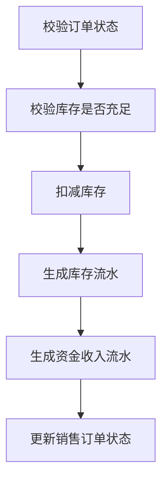

# TruckFarm 架构设计

版本：v0.2
日期：2026-05-13
状态：数字沙盘架构草案

## 1. 架构目标

TruckFarm 迭代升级版采用前后端分离架构和数字沙盘架构，目标是在旧项目基础上逐步替换旧技术栈，并将普通农场管理平台升级为可模拟经营过程、可追踪随机结果、可复盘决策影响的简历项目：

- 后端使用 Spring Boot 4 构建模块化单体应用。
- 前端使用 Vue 3 + TypeScript 构建经营管理与数字沙盘一体化界面。
- 数据库使用 PostgreSQL，缓存使用 Redis 7。
- 接口统一使用 RESTful + JSON。
- 认证授权使用 Spring Security + JWT。
- 支持 Docker Compose 一键启动开发和演示环境。
- 支持 Flyway、OpenAPI、自动化测试和 CI。
- 支持 Simulation Engine，通过时间 Tick 推进天气、地块、作物、库存、资金和市场状态。
- 支持规则引擎 + AI 修正 + 随机种子的非固定操作结果机制。

## 2. 总体架构



开发环境：

```text
frontend dev server -> backend Spring Boot -> PostgreSQL / Redis
```

演示环境：

```text
Nginx static frontend -> backend container -> PostgreSQL container / Redis container
```

## 3. 技术栈

### 3.1 后端

| 技术 | 用途 |
| --- | --- |
| JDK 25 | Java 运行环境 |
| Spring Boot 4 | 应用框架 |
| Spring Security | 认证与授权 |
| JWT | 无状态登录凭证 |
| MyBatis 3 / MyBatis Plus（兼容验证后） | 数据访问与基础 CRUD |
| PostgreSQL | 关系型数据库 |
| Redis 7 | Token 黑名单、权限缓存、沙盘缓存、预警去重 |
| MapStruct | Entity / DTO / Response 转换 |
| Flyway | 数据库版本管理 |
| SpringDoc OpenAPI 或 Knife4j（兼容验证后） | 接口文档 |
| JUnit 5 / Mockito / AssertJ | 测试 |
| Spring Scheduler / Quartz（可选） | 时间推进和定时模拟 |

### 3.2 前端

| 技术 | 用途 |
| --- | --- |
| Vue 3 | 前端框架 |
| TypeScript | 类型约束 |
| Vite | 构建工具 |
| Element Plus | UI 组件库 |
| Pinia | 状态管理 |
| Vue Router | 路由管理 |
| Axios | HTTP 请求 |
| ECharts | 数据可视化 |
| SVG / Canvas / Konva.js（可选） | 地块沙盘与模拟结果展示 |

### 3.3 Spring Boot 4 兼容性验证

Spring Boot 4 是升级版的目标框架，但生态依赖需要先验证再正式落地：

- Java 25：验证本机 JDK、Maven Toolchain、编译和运行参数。
- PostgreSQL：验证 JDBC Driver、连接池、事务和本地 Docker Compose。
- Flyway：验证 PostgreSQL migration、初始化脚本和测试环境重复执行。
- MyBatis / MyBatis Plus：先保证 MyBatis 3 可用；MyBatis Plus 通过 Spring Boot 4 starter 兼容验证后再引入。
- Redis：验证 Spring Data Redis 与 Token 黑名单、权限缓存、沙盘缓存场景。
- OpenAPI：优先验证 SpringDoc；若暂未适配 Spring Boot 4，接口文档能力延后但保留 REST 约定。

兼容性结论统一回写 `docs/tasks.md` 的 `P1.x` 小目标，不单独维护平行验证文档。

## 4. 核心业务闭环

TruckFarm 的一条完整经营主线如下：

```text
初始化农场
  -> 采购种子 / 物资
  -> 播种
  -> 推进日期
  -> 天气变化 / 事件触发
  -> 生长状态变化
  -> 收获入库
  -> 销售出库
  -> 资金变化
  -> 经营复盘
```

架构上的核心原则：

- 管理系统是底座，模拟引擎是核心亮点，经营决策是主线。
- 所有非固定结果先由本地规则给出基础范围，再接 AI 修正和随机采样。
- AI 只能提供修正因子和解释，不能直接写入库存、资金、订单状态等核心事实数据。
- 所有经营动作都应可回溯到上下文、规则、AI 状态、随机种子和最终结果。

## 5. 数字沙盘核心架构

### 5.1 模拟引擎流程

```text
FarmActionService
  -> SimulationContextBuilder
  -> RuleEvaluator
  -> AiModifierService
  -> ModifierValidator
  -> OutcomeSampler
  -> SimulationOutcomeRecorder
  -> BusinessApplyService
  -> FundFlowService
  -> FarmEventService
```

### 5.2 非固定结果链路



### 5.3 AI 降级策略

```text
AI 正常：基础规则区间 + AI 修正因子 + 随机种子采样
AI 失败：基础规则区间 + 默认修正因子 + 随机种子采样
AI 超限：基础规则区间 + 裁剪后的修正因子 + 随机种子采样
```

AI 调用状态必须记录为 `SUCCESS`、`FALLBACK`、`INVALID_OUTPUT` 或 `DISABLED`，方便后续排查和演示。

### 5.4 模块职责

| 模块 | 职责 |
| --- | --- |
| `simulation/action` | 记录用户经营动作，例如采购、播种、浇水、施肥、收获、销售 |
| `simulation/context` | 聚合天气、地块、作物、供应商、库存、市场、资金等上下文 |
| `simulation/rule` | 计算基础结果区间和风险标签 |
| `simulation/random` | 根据随机种子生成可复现结果 |
| `simulation/outcome` | 保存基础规则、AI 修正、最终结果和 random seed |
| `simulation/event` | 生成天气、病虫害、市场波动、库存损耗等事件 |
| `weather` | 生成和查询每日天气 |
| `market` | 维护作物市场价格和行情波动 |
| `finance` | 记录采购支出、销售收入和经营资金变化 |
| `report` | 生成经营复盘和收益分析 |
| `ai` | 封装 AI Provider、Prompt、Mock、结构化输出解析 |

## 6. 后端分层

```text
Controller -> Service -> Mapper
                ↕
        Infrastructure
                ↕
        Simulation / Finance / AI
```

### 6.1 Controller

Controller 只负责定义 REST API、参数校验、权限入口、调用 Service 和返回 `Result<T>`。禁止编写业务逻辑、拼接 SQL、直接操作 Redis 或直接返回 Entity。

### 6.2 Service

Service 负责业务编排、状态流转、事务边界、跨模块调用和业务异常转换。采购入库、销售出库、完成收获、资金流水写入等需要保证多表一致性的操作必须放在 Service 事务中。

### 6.3 Mapper

Mapper 默认使用 MyBatis 3 Mapper 接口 + XML。简单 CRUD 可以在 MyBatis Plus 兼容验证通过后使用 `BaseMapper<XxxEntity>`；复杂 SQL 必须写在 XML 中。排序字段必须使用白名单，查询必须考虑 `deleted = false`。

### 6.4 Infrastructure

Infrastructure 封装 Redis、文件存储、AI 调用、通知渠道和定时任务等技术细节，对业务层提供稳定接口。

## 7. 业务模块划分

```text
modules/
├── auth
├── user
├── organization
├── crop
├── field
├── planting
├── supplier
├── procurement
├── inventory
├── customer
├── sales
├── finance
├── dashboard
├── simulation
├── weather
├── market
├── event
├── report
├── ai
└── system
```

模块依赖规则：

- `auth` 可以依赖 `user`。
- `planting` 可以依赖 `crop`、`field`、`organization`。
- `procurement` 可以依赖 `supplier`、`inventory`、`finance`。
- `sales` 可以依赖 `customer`、`inventory`、`finance`。
- `dashboard` 和 `report` 可以查询多个模块，但只做统计，不修改业务数据。
- `simulation` 负责串联上下文、规则、采样、落库和事件，不持有页面层概念。
- 不允许模块间循环依赖。

## 8. 前端架构

### 8.1 页面分区

前端采用“经营管理 + 数字沙盘”双视角：

- 经营管理：作物、地块、种植、采购、库存、销售、权限。
- 数字沙盘：首页沙盘、地块沙盘、时间线、模拟动作结果、经营复盘。

### 8.2 状态管理

推荐 Pinia 拆分：

- `authStore`：Token、当前用户、权限。
- `farmStore`：当前模拟日期、天气、经营摘要。
- `simulationStore`：最新动作结果、当前事件、回放信息。
- `dictStore`：字典和基础枚举。

### 8.3 前端数据边界

- 页面组件负责交互编排与展示。
- API 请求集中到 `api/`。
- 图表逻辑、沙盘计算和结果展示逻辑优先抽成 composable 或独立组件。
- 页面不直接拼接接口 URL，不直接维护后端事实状态。

## 9. 认证与授权架构



Token 规则：

- Access Token 有较短有效期。
- Refresh Token 有较长有效期。
- 退出登录后 Token 加入 Redis 黑名单。
- Token 中只保存必要信息，不保存密码、手机号等敏感字段。

权限规则：

- 接口权限使用注解或 Spring Security 配置控制。
- 菜单权限由后端返回树形结构。
- 按钮权限通过权限编码控制，例如 `crop:create`、`sales:ship`、`simulation:tick`。

## 10. 数据一致性设计

### 10.1 采购入库 + 资金支出



### 10.2 销售出库 + 资金收入



要求：

- 上述步骤必须在同一事务中完成。
- 库存扣减需要防止并发超卖。
- 资金流水和业务单据状态必须在事务内保持一致。
- 可以使用乐观锁版本号或数据库条件更新。

状态流转必须通过业务方法完成，例如 `startPlantingPlan`、`completeHarvest`、`confirmProcurementInbound`、`shipSalesOrder`。禁止前端直接传任意状态值覆盖数据库。

## 11. 缓存设计

| 缓存内容 | Key | TTL | 说明 |
| --- | --- | --- | --- |
| 验证码 | `truckfarm:captcha:{uuid}` | 5 分钟 | 登录验证码 |
| Token 黑名单 | `truckfarm:auth:blacklist:{tokenId}` | Token 剩余有效期 | 退出登录 |
| 用户权限 | `truckfarm:auth:permissions:{userId}` | 30 分钟 | 权限缓存 |
| 字典数据 | `truckfarm:dict:{dictType}` | 1 小时 | 字典缓存 |
| 首页沙盘摘要 | `truckfarm:dashboard:summary` | 5 分钟 | 低频统计缓存 |
| 当前农场状态 | `truckfarm:simulation:farm-state` | 5 分钟 | 日期、天气、风险摘要 |

原则：数据库是最终事实来源；重要业务写操作完成后主动清理相关缓存；临时缓存必须设置 TTL。

## 12. 异常、日志与可观测性

统一响应格式：

```json
{
  "code": 0,
  "message": "success",
  "data": {}
}
```

规则：

- 业务异常通过 `BusinessException(ErrorCode.XXX, message)` 抛出，由 `GlobalExceptionHandler` 统一转换响应。
- 使用 SLF4J 输出结构化日志。
- 登录、登出、关键经营动作写操作日志。
- 模拟 Tick、AI 调用、事件生成和资金流水要保留可排查日志。
- 异常日志必须保留堆栈，敏感字段必须脱敏。

## 13. 项目结构约束

后端每个业务模块建议结构：

```text
modules/crop/
├── controller/
├── service/
├── mapper/
├── entity/
├── dto/
├── request/
├── response/
├── converter/
└── enums/
```

前端每个业务页面建议结构：

```text
views/crop/
├── CropListView.vue
├── CropFormDialog.vue
└── components/
```

## 14. 风险与演进策略

| 风险 | 对策 |
| --- | --- |
| 业务范围过大 | MVP 先打通核心闭环，AI、附件、通知放二期 |
| 简历项目退化成普通 CRUD | 强化沙盘、时间推进、非固定结果、资金变化和复盘设计 |
| 表设计过早复杂化 | 先满足单农场场景，预留但不实现多租户 |
| 前后端接口反复变动 | 先维护 `docs/api.md`，再开发接口 |
| 旧代码和升级代码边界不清 | 旧代码作为迁移源保留，升级代码放 `backend/` 和 `frontend/` |
| Spring Boot 4 生态不稳定 | 先做 P1 兼容验证，未适配依赖记录原因并延后 |
