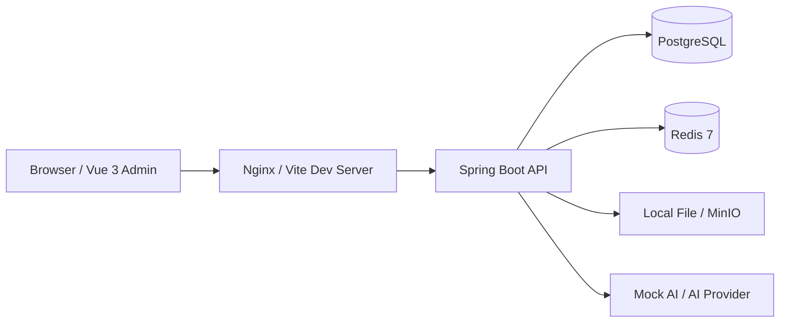
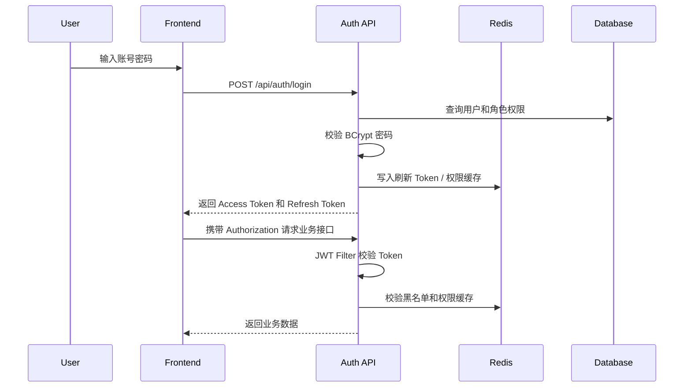
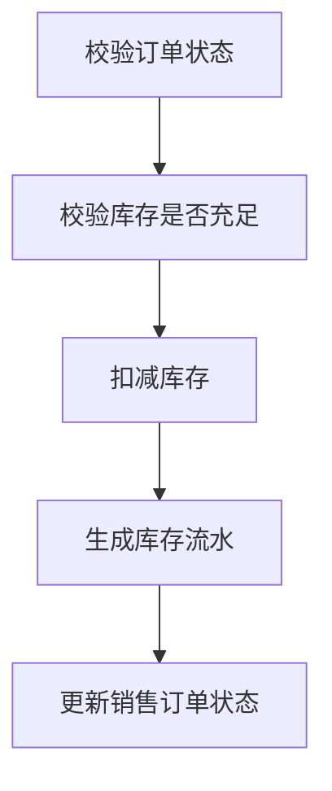

# TruckFarm 架构设计

版本：v0.1
日期：2026-05-12
状态：架构草案

## 1. 架构目标

TruckFarm 迭代升级版采用前后端分离架构，目标是在旧项目基础上逐步替换旧技术栈，并让项目具备真实简历项目所需的工程完整度：

- 后端使用 Spring Boot 4 构建模块化单体应用。
- 前端使用 Vue 3 + TypeScript 构建管理后台。
- 数据库使用 PostgreSQL，缓存使用 Redis 7。
- 接口统一使用 RESTful + JSON。
- 认证授权使用 Spring Security + JWT。
- 支持 Docker Compose 一键启动开发和演示环境。
- 支持 OpenAPI 文档、数据库版本管理、自动化测试和 CI。

## 2. 总体架构



开发环境：

```text
frontend dev server -> backend Spring Boot -> PostgreSQL / Redis
```

演示环境：

```text
Nginx static frontend -> backend container -> PostgreSQL container / Redis container
```

## 3. 技术栈

### 3.1 后端

| 技术 | 用途 |
| --- | --- |
| JDK 25 | Java 运行环境 |
| Spring Boot 4 | 应用框架 |
| Spring Security | 认证与授权 |
| JWT | 无状态登录凭证 |
| MyBatis 3 / MyBatis Plus（兼容验证后） | 数据访问与基础 CRUD |
| PostgreSQL | 关系型数据库 |
| Redis 7 | Token 黑名单、验证码、缓存、预警去重 |
| MapStruct | Entity / DTO / Response 转换 |
| SpringDoc OpenAPI 或 Knife4j（兼容验证后） | 接口文档 |
| Flyway | 数据库版本管理 |
| JUnit 5 / Mockito / AssertJ | 测试 |

### 3.2 前端

| 技术 | 用途 |
| --- | --- |
| Vue 3 | 前端框架 |
| TypeScript | 类型约束 |
| Vite | 构建工具 |
| Element Plus | UI 组件库 |
| Pinia | 状态管理 |
| Vue Router | 路由管理 |
| Axios | HTTP 请求 |
| ECharts | 数据可视化 |


### 3.3 Spring Boot 4 兼容性验证

Spring Boot 4 是升级版的目标框架，但生态依赖需要先验证再正式落地：

- Java 25：验证本机 JDK、Maven Toolchain、编译和运行参数。
- PostgreSQL：验证 JDBC Driver、连接池、事务和本地 Docker Compose。
- Flyway：验证 PostgreSQL migration、初始化脚本和测试环境重复执行。
- MyBatis / MyBatis Plus：先保证 MyBatis 3 可用；MyBatis Plus 通过 Spring Boot 4 starter 兼容验证后再引入。
- Redis：验证 Spring Data Redis 与 Token 黑名单、权限缓存场景。
- OpenAPI：优先验证 SpringDoc；若暂未适配 Spring Boot 4，接口文档能力延后但保留 REST 约定。

## 4. 后端分层

```text
Controller -> Service -> Mapper
                ↕
        Infrastructure
```

### 4.1 Controller

Controller 只负责定义 REST API、参数校验、权限入口、调用 Service 和返回 `Result<T>`。禁止编写业务逻辑、拼接 SQL、直接操作 Redis 或直接返回 Entity。

### 4.2 Service

Service 负责业务编排、状态流转、事务边界、跨模块调用和业务异常转换。采购入库、销售出库、完成收获等需要保证多表一致性的操作必须放在 Service 事务中。

### 4.3 Mapper

Mapper 默认使用 MyBatis 3 Mapper 接口 + XML。简单 CRUD 可以在 MyBatis Plus 兼容验证通过后使用 `BaseMapper<XxxEntity>`；复杂 SQL 必须写在 XML 中。排序字段必须使用白名单，查询必须考虑 `deleted = false`。

### 4.4 Infrastructure

Infrastructure 封装 Redis、文件存储、AI 调用、通知渠道和定时任务等技术细节，对业务层提供稳定接口。

## 5. 业务模块划分

```text
modules/
├── auth
├── user
├── organization
├── crop
├── field
├── planting
├── supplier
├── procurement
├── inventory
├── customer
├── sales
├── dashboard
├── ai
└── system
```

模块依赖规则：

- `auth` 可以依赖 `user`。
- `planting` 可以依赖 `crop`、`field`、`organization`。
- `procurement` 可以依赖 `supplier`、`inventory`。
- `sales` 可以依赖 `customer`、`inventory`。
- `dashboard` 可以查询多个模块，但只做统计，不修改业务数据。
- 不允许模块间循环依赖。

## 6. 认证与授权架构



Token 规则：

- Access Token 有较短有效期。
- Refresh Token 有较长有效期。
- 退出登录后 Token 加入 Redis 黑名单。
- Token 中只保存必要信息，不保存密码、手机号等敏感字段。

权限规则：

- 接口权限使用注解或 Spring Security 配置控制。
- 菜单权限由后端返回树形结构。
- 按钮权限通过权限编码控制，例如 `crop:create`、`sales:ship`。

## 7. 数据一致性设计

销售出库流程：



要求：

- 上述步骤必须在同一事务中完成。
- 库存扣减需要防止并发超卖。
- 可以使用乐观锁版本号或数据库条件更新。

状态流转必须通过业务方法完成，例如 `startPlantingPlan`、`completeHarvest`、`confirmProcurementInbound`、`shipSalesOrder`。禁止前端直接传任意状态值覆盖数据库。

## 8. 缓存设计

| 缓存内容 | Key | TTL | 说明 |
| --- | --- | --- | --- |
| 验证码 | `truckfarm:captcha:{uuid}` | 5 分钟 | 登录验证码 |
| Token 黑名单 | `truckfarm:auth:blacklist:{tokenId}` | Token 剩余有效期 | 退出登录 |
| 用户权限 | `truckfarm:auth:permissions:{userId}` | 30 分钟 | 权限缓存 |
| 字典数据 | `truckfarm:dict:{dictType}` | 1 小时 | 字典缓存 |
| 首页统计 | `truckfarm:dashboard:summary` | 5 分钟 | 低频统计缓存 |

原则：数据库是最终事实来源；重要业务写操作完成后主动清理相关缓存；临时缓存必须设置 TTL。

## 9. 异常与响应

统一响应格式：

```json
{
  "code": 0,
  "message": "success",
  "data": {}
}
```

业务异常通过 `BusinessException(ErrorCode.XXX, message)` 抛出，由 `GlobalExceptionHandler` 统一转换响应。

## 10. 可观测性

- 使用 SLF4J 输出结构化日志。
- 登录、登出、关键业务动作写操作日志。
- 定时任务输出开始、结束、处理数量、失败数量。
- 异常日志必须保留堆栈。
- 敏感字段必须脱敏。

## 11. 项目结构约束

后端每个业务模块建议结构：

```text
modules/crop/
├── controller/
├── service/
├── mapper/
├── entity/
├── dto/
├── request/
├── response/
├── converter/
└── enums/
```

前端每个业务页面建议结构：

```text
views/crop/
├── CropListView.vue
├── CropFormDialog.vue
└── components/
```

## 12. 风险与对策

| 风险 | 对策 |
| --- | --- |
| 业务范围过大 | MVP 先打通核心闭环，AI、附件、通知放二期 |
| 简历项目变成普通 CRUD | 加强库存事务、状态流转、看板统计和权限体系 |
| 表设计过早复杂化 | 先满足单农场场景，预留但不实现多租户 |
| 前后端接口反复变动 | 先维护 `docs/api.md`，再开发接口 |
| 旧代码和升级代码边界不清 | 旧代码作为 legacy 学习对照和迁移源保留，升级代码放 `backend/` 和 `frontend/` |

