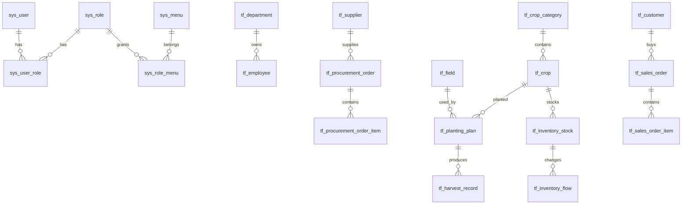

# TruckFarm 数据库设计

版本：v0.1
日期：2026-05-12
状态：数据库草案

## 1. 设计原则

- 数据库使用 PostgreSQL，版本管理使用 Flyway。
- 表名使用小写下划线。
- 系统表使用 `sys_` 前缀，业务表使用 `tf_` 前缀。
- 主键统一为 `id BIGINT GENERATED BY DEFAULT AS IDENTITY`，外键字段使用 `BIGINT`。
- 金额使用 `NUMERIC(12,2)`。
- 数量、面积使用 `NUMERIC(12,2)` 或 `NUMERIC(14,3)`。
- 时间使用 `TIMESTAMP`，纯日期使用 `DATE`。
- 核心业务表使用逻辑删除字段 `deleted BOOLEAN DEFAULT FALSE`。
- 通用审计字段：`created_at`、`updated_at`、`created_by`、`updated_by`。
- 状态字段使用枚举 code 或字典表约束，禁止魔法字符串散落。

## 2. Flyway 版本管理

- Flyway 脚本放在 `backend/src/main/resources/db/migration/`。
- 版本命名使用 `V{版本号}__{说明}.sql`，例如 `V1__init_system_tables.sql`。
- 初始化顺序建议：系统权限表 -> 组织人员表 -> 作物地块表 -> 种植表 -> 采购库存销售表 -> 演示数据。
- 已合并执行过的 migration 禁止直接修改；需要调整时新增下一个版本脚本。
- PostgreSQL 语法以 Flyway 脚本为准，旧版 `table.sql` 只作为字段和菜单参考。

## 3. 概念模型

## 4. 系统表

### 4.1 sys_user

| 字段 | 类型 | 说明 |
| --- | --- | --- |
| id | BIGINT IDENTITY PK | 用户 ID |
| username | VARCHAR(64) | 登录账号，唯一 |
| password | VARCHAR(255) | BCrypt 密码 |
| nickname | VARCHAR(64) | 昵称 |
| phone | VARCHAR(32) | 手机号 |
| email | VARCHAR(128) | 邮箱 |
| avatar_url | VARCHAR(512) | 头像 |
| status | VARCHAR(32) | ENABLED / DISABLED |
| last_login_at | TIMESTAMP | 最近登录时间 |
| created_at | TIMESTAMP | 创建时间 |
| updated_at | TIMESTAMP | 更新时间 |
| created_by | BIGINT | 创建人 |
| updated_by | BIGINT | 更新人 |
| deleted | BOOLEAN | 逻辑删除 |

索引：`uk_sys_user_username(username)`、`idx_sys_user_status(status)`。

### 4.2 sys_role

| 字段 | 类型 | 说明 |
| --- | --- | --- |
| id | BIGINT IDENTITY PK | 角色 ID |
| role_code | VARCHAR(64) | 角色编码，唯一 |
| role_name | VARCHAR(64) | 角色名称 |
| status | VARCHAR(32) | ENABLED / DISABLED |
| remark | VARCHAR(255) | 备注 |
| created_at | TIMESTAMP | 创建时间 |
| updated_at | TIMESTAMP | 更新时间 |
| created_by | BIGINT | 创建人 |
| updated_by | BIGINT | 更新人 |
| deleted | BOOLEAN | 逻辑删除 |

### 4.3 sys_menu

| 字段 | 类型 | 说明 |
| --- | --- | --- |
| id | BIGINT IDENTITY PK | 菜单 ID |
| parent_id | BIGINT | 父菜单 ID |
| menu_type | VARCHAR(32) | DIRECTORY / MENU / BUTTON |
| menu_name | VARCHAR(64) | 菜单名称 |
| permission_code | VARCHAR(128) | 权限编码 |
| route_path | VARCHAR(255) | 前端路由 |
| component | VARCHAR(255) | 前端组件路径 |
| icon | VARCHAR(64) | 图标 |
| sort_order | INT | 排序 |
| visible | BOOLEAN | 是否显示 |
| status | VARCHAR(32) | ENABLED / DISABLED |
| created_at | TIMESTAMP | 创建时间 |
| updated_at | TIMESTAMP | 更新时间 |
| deleted | BOOLEAN | 逻辑删除 |

### 4.4 关系与日志表

`sys_user_role`：`id`、`user_id`、`role_id`，唯一索引 `(user_id, role_id)`。

`sys_role_menu`：`id`、`role_id`、`menu_id`，唯一索引 `(role_id, menu_id)`。

`sys_operation_log`：记录模块、操作、HTTP 方法、请求路径、操作人、IP、状态、错误信息、耗时、创建时间。

## 5. 组织与人员表

### 5.1 tf_department

| 字段 | 类型 | 说明 |
| --- | --- | --- |
| id | BIGINT IDENTITY PK | 部门 ID |
| parent_id | BIGINT | 父部门 ID |
| dept_name | VARCHAR(64) | 部门名称 |
| dept_code | VARCHAR(64) | 部门编码 |
| manager_id | BIGINT | 负责人 |
| status | VARCHAR(32) | ENABLED / DISABLED |
| remark | VARCHAR(255) | 备注 |
| created_at | TIMESTAMP | 创建时间 |
| updated_at | TIMESTAMP | 更新时间 |
| deleted | BOOLEAN | 逻辑删除 |

### 5.2 tf_employee

| 字段 | 类型 | 说明 |
| --- | --- | --- |
| id | BIGINT IDENTITY PK | 员工 ID |
| user_id | BIGINT | 关联系统用户，可为空 |
| department_id | BIGINT | 部门 ID |
| employee_no | VARCHAR(64) | 员工编号 |
| employee_name | VARCHAR(64) | 员工姓名 |
| phone | VARCHAR(32) | 手机号 |
| position_name | VARCHAR(64) | 岗位 |
| status | VARCHAR(32) | ACTIVE / RESIGNED / DISABLED |
| joined_at | DATE | 入职日期 |
| left_at | DATE | 离职日期 |
| created_at | TIMESTAMP | 创建时间 |
| updated_at | TIMESTAMP | 更新时间 |
| deleted | BOOLEAN | 逻辑删除 |

## 6. 作物与地块表

### 6.1 tf_crop_category

| 字段 | 类型 | 说明 |
| --- | --- | --- |
| id | BIGINT IDENTITY PK | 分类 ID |
| category_name | VARCHAR(64) | 分类名称 |
| sort_order | INT | 排序 |
| status | VARCHAR(32) | ENABLED / DISABLED |
| created_at | TIMESTAMP | 创建时间 |
| updated_at | TIMESTAMP | 更新时间 |
| deleted | BOOLEAN | 逻辑删除 |

### 6.2 tf_crop

| 字段 | 类型 | 说明 |
| --- | --- | --- |
| id | BIGINT IDENTITY PK | 作物 ID |
| category_id | BIGINT | 分类 ID |
| crop_name | VARCHAR(64) | 作物名称 |
| growth_cycle_days | INT | 生长周期天数 |
| reference_price | NUMERIC(12,2) | 参考价格 |
| unit | VARCHAR(16) | 默认单位，如 kg |
| image_url | VARCHAR(512) | 图片 |
| description | VARCHAR(1024) | 描述 |
| status | VARCHAR(32) | ENABLED / DISABLED |
| created_at | TIMESTAMP | 创建时间 |
| updated_at | TIMESTAMP | 更新时间 |
| deleted | BOOLEAN | 逻辑删除 |

索引：`idx_tf_crop_category(category_id)`、`idx_tf_crop_name(crop_name)`。

### 6.3 tf_field

| 字段 | 类型 | 说明 |
| --- | --- | --- |
| id | BIGINT IDENTITY PK | 地块 ID |
| field_code | VARCHAR(64) | 地块编号，唯一 |
| field_name | VARCHAR(64) | 地块名称 |
| area | NUMERIC(12,2) | 面积 |
| area_unit | VARCHAR(16) | 面积单位，如 mu |
| location | VARCHAR(255) | 位置 |
| soil_type | VARCHAR(64) | 土壤类型 |
| status | VARCHAR(32) | IDLE / PLANTING / FALLOW / DISABLED |
| remark | VARCHAR(255) | 备注 |
| created_at | TIMESTAMP | 创建时间 |
| updated_at | TIMESTAMP | 更新时间 |
| deleted | BOOLEAN | 逻辑删除 |

## 7. 种植表

### 7.1 tf_planting_plan

| 字段 | 类型 | 说明 |
| --- | --- | --- |
| id | BIGINT IDENTITY PK | 计划 ID |
| plan_no | VARCHAR(64) | 计划编号，唯一 |
| crop_id | BIGINT | 作物 ID |
| field_id | BIGINT | 地块 ID |
| manager_id | BIGINT | 负责人员工 ID |
| planned_area | NUMERIC(12,2) | 计划种植面积 |
| start_date | DATE | 计划开始日期 |
| expected_harvest_date | DATE | 预计收获日期 |
| actual_start_date | DATE | 实际开始日期 |
| status | VARCHAR(32) | PENDING / PLANTING / HARVESTED / CANCELED |
| remark | VARCHAR(255) | 备注 |
| created_at | TIMESTAMP | 创建时间 |
| updated_at | TIMESTAMP | 更新时间 |
| deleted | BOOLEAN | 逻辑删除 |

索引：`plan_no` 唯一索引、`crop_id`、`field_id`、`status`。

### 7.2 tf_harvest_record

| 字段 | 类型 | 说明 |
| --- | --- | --- |
| id | BIGINT IDENTITY PK | 收获记录 ID |
| plan_id | BIGINT | 种植计划 ID |
| crop_id | BIGINT | 作物 ID |
| field_id | BIGINT | 地块 ID |
| actual_harvest_date | DATE | 实际收获日期 |
| yield_quantity | NUMERIC(14,3) | 产量 |
| loss_quantity | NUMERIC(14,3) | 损耗 |
| unit | VARCHAR(16) | 单位 |
| remark | VARCHAR(255) | 备注 |
| created_at | TIMESTAMP | 创建时间 |
| created_by | BIGINT | 创建人 |
| deleted | BOOLEAN | 逻辑删除 |

## 8. 采购表

### 8.1 tf_supplier

供应商表字段：`id`、`supplier_name`、`contact_name`、`contact_phone`、`address`、`status`、`remark`、通用审计字段和 `deleted`。

### 8.2 tf_procurement_order

| 字段 | 类型 | 说明 |
| --- | --- | --- |
| id | BIGINT IDENTITY PK | 采购单 ID |
| order_no | VARCHAR(64) | 采购单号，唯一 |
| supplier_id | BIGINT | 供应商 ID |
| manager_id | BIGINT | 负责人 |
| order_date | DATE | 采购日期 |
| total_amount | NUMERIC(12,2) | 总金额 |
| status | VARCHAR(32) | DRAFT / PENDING_INBOUND / INBOUNDED / CANCELED |
| remark | VARCHAR(255) | 备注 |
| created_at | TIMESTAMP | 创建时间 |
| updated_at | TIMESTAMP | 更新时间 |
| deleted | BOOLEAN | 逻辑删除 |

### 8.3 tf_procurement_order_item

字段：`id`、`order_id`、`crop_id`、`quantity`、`unit`、`unit_price`、`amount`、`created_at`、`deleted`。

## 9. 库存表

### 9.1 tf_inventory_stock

| 字段 | 类型 | 说明 |
| --- | --- | --- |
| id | BIGINT IDENTITY PK | 库存 ID |
| crop_id | BIGINT | 作物 ID，唯一 |
| quantity | NUMERIC(14,3) | 当前库存 |
| unit | VARCHAR(16) | 单位 |
| alert_threshold | NUMERIC(14,3) | 预警阈值 |
| version | INT | 乐观锁版本 |
| created_at | TIMESTAMP | 创建时间 |
| updated_at | TIMESTAMP | 更新时间 |
| deleted | BOOLEAN | 逻辑删除 |

### 9.2 tf_inventory_flow

| 字段 | 类型 | 说明 |
| --- | --- | --- |
| id | BIGINT IDENTITY PK | 流水 ID |
| stock_id | BIGINT | 库存 ID |
| crop_id | BIGINT | 作物 ID |
| flow_type | VARCHAR(32) | INBOUND / OUTBOUND / ADJUSTMENT |
| quantity_change | NUMERIC(14,3) | 变动数量 |
| quantity_before | NUMERIC(14,3) | 变动前数量 |
| quantity_after | NUMERIC(14,3) | 变动后数量 |
| unit | VARCHAR(16) | 单位 |
| biz_type | VARCHAR(32) | PROCUREMENT / SALES / MANUAL |
| biz_no | VARCHAR(64) | 来源单号 |
| remark | VARCHAR(255) | 备注 |
| created_at | TIMESTAMP | 创建时间 |
| created_by | BIGINT | 创建人 |

索引：`crop_id`、`(biz_type, biz_no)`、`created_at`。

## 10. 销售表

### 10.1 tf_customer

客户表字段：`id`、`customer_name`、`contact_name`、`contact_phone`、`address`、`status`、`remark`、通用审计字段和 `deleted`。

### 10.2 tf_sales_order

| 字段 | 类型 | 说明 |
| --- | --- | --- |
| id | BIGINT IDENTITY PK | 销售单 ID |
| order_no | VARCHAR(64) | 销售单号，唯一 |
| customer_id | BIGINT | 客户 ID |
| manager_id | BIGINT | 负责人 |
| order_date | DATE | 销售日期 |
| total_amount | NUMERIC(12,2) | 总金额 |
| status | VARCHAR(32) | DRAFT / PENDING_SHIPMENT / COMPLETED / CANCELED |
| remark | VARCHAR(255) | 备注 |
| created_at | TIMESTAMP | 创建时间 |
| updated_at | TIMESTAMP | 更新时间 |
| deleted | BOOLEAN | 逻辑删除 |

### 10.3 tf_sales_order_item

字段：`id`、`order_id`、`crop_id`、`quantity`、`unit`、`unit_price`、`amount`、`created_at`、`deleted`。

## 11. 扩展表

### 11.1 tf_file_resource

用于二期附件能力，字段包括业务类型、业务 ID、文件名、扩展名、MIME、文件大小、存储类型、存储路径、创建人、创建时间和逻辑删除。

### 11.2 tf_ai_analysis

用于二期 AI 能力，字段包括分析类型、业务类型、业务 ID、Prompt 版本、输入摘要、输出内容、状态、错误信息、创建人和创建时间。

## 12. 字典建议

| 字典类型 | 取值 |
| --- | --- |
| common_status | ENABLED, DISABLED |
| employee_status | ACTIVE, RESIGNED, DISABLED |
| field_status | IDLE, PLANTING, FALLOW, DISABLED |
| planting_status | PENDING, PLANTING, HARVESTED, CANCELED |
| procurement_status | DRAFT, PENDING_INBOUND, INBOUNDED, CANCELED |
| sales_status | DRAFT, PENDING_SHIPMENT, COMPLETED, CANCELED |
| inventory_flow_type | INBOUND, OUTBOUND, ADJUSTMENT |
| inventory_biz_type | PROCUREMENT, SALES, MANUAL |

## 13. 初始化数据

MVP 需要准备：管理员账号、系统角色、动态菜单、作物分类、作物、地块、供应商、客户、采购单、销售单、库存流水和种植计划演示数据。
